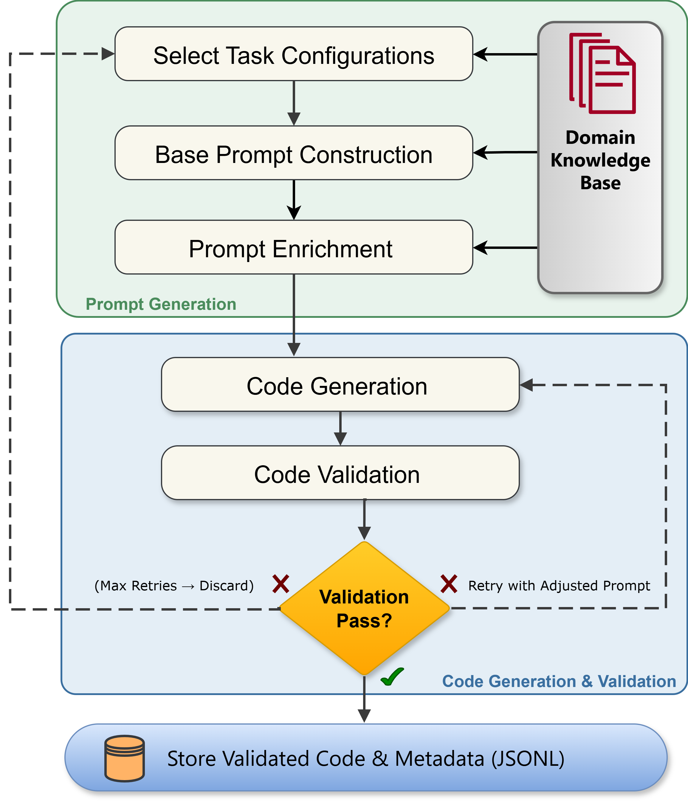
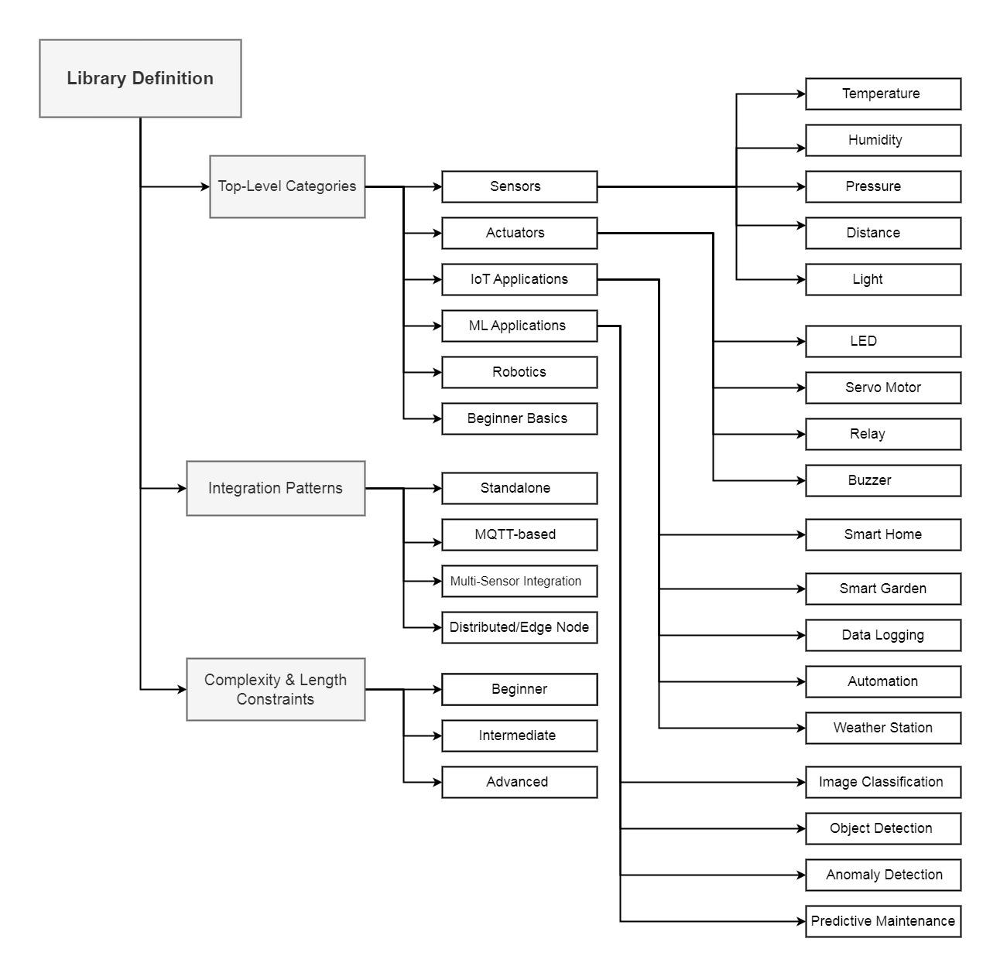
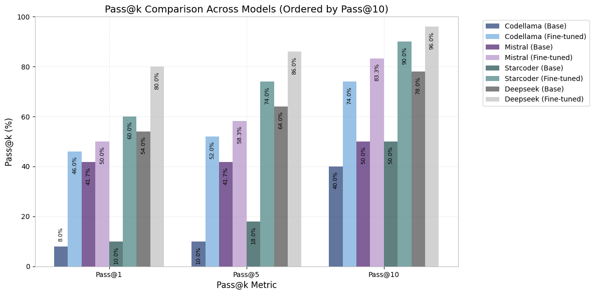

# Hardware-Aware Embedded Python Code Generation — Dataset & Generation Pipeline

A domain-specific **dataset** of instruction→code pairs for **hardware-aware embedded Python**
on Raspberry Pi, plus the **validation-in-the-loop pipeline** used to synthesize and validate it.

General-purpose code LLMs often produce Python that is syntactically valid but *physically
non-functional* on real hardware — wrong GPIO numbering (BCM vs BOARD), hallucinated library
functions, missing peripheral initialization. This corpus targets that gap across GPIO, I2C, SPI,
UART, PWM/motor, camera/CV, sensors, and networking/MQTT.

This repository is the supporting material for the paper:

> **LLMs for Hardware-Aware Embedded Python Code Generation: Benchmark-Driven Comparative Study**
> Muhammad Saqib Saeed, Benaoumeur Senouci — University of Southern Denmark, 2026.

<p align="center">
  <br>
  <em>Automated synthetic data pipeline with validation-in-the-loop verification.</em>
</p>

---

## Repository layout

```
.
├── data/                      # the dataset + its licensing & documentation
│   ├── dataset_clean.jsonl    #  instruction→code pairs (~64 MB)
│   ├── DATASHEET.md               # Datasheets-for-Datasets documentation
│   ├── KNOWN_ISSUES.md            # corpus errata — read before reproducing results
│   ├── LICENSE.md                 # layered dataset license (read before reuse)
│   └── THIRD_PARTY_NOTICES.md     # attribution for community-sourced code
├── pipeline/                  # the generation/validation pipeline (MIT-licensed code)
│   ├── cgs_v3.py                  # orchestrator / CLI
│   ├── prompt_generator.py        # two-stage prompt construction
│   ├── code_generator.py          # prompt → code, fence extraction, retry
│   ├── prompt_standardizer.py     # concise-instruction rewrite
│   ├── validation.py              # validation-in-the-loop + quality score
│   ├── dkb.py                     # domain knowledge base: taxonomy + whitelist/blacklist
│   ├── api_client.py              # Gemini HTTP client (key rotation, backoff)
│   ├── progress_manager.py        # atomic checkpoint / resume
│   ├── tests/                     # pytest suite
│   └── README.md                  # full pipeline docs
├── LICENSE                    # MIT — applies to pipeline/ source code
├── CITATION.cff               # how to cite
└── .gitattributes             # text / line-ending attributes
```

---

## The dataset (`data/dataset_clean.jsonl`)

Additional community-sourced examples from the corpus will be
added in a future release once their licenses have been verified. Each line:

| Field | Type | Description |
|---|---|---|
| `id` | string | Unique opaque record identifier (e.g. `llm4ep-b744ff9171ca`) |
| `prompt` | string | Instruction describing the hardware task |
| `completion` | string | Python implementation (Raspberry Pi target) |
| `categories` | list[str] | 6 broader categories, 18 functional/hardware labels |
| `metadata` | object | `task` (nullable), `complexity`, `provenance` |

Every record carries machine-readable licensing **provenance** under `metadata.provenance`
(`license`, `redistributable`, plus `source_repo`, `source_url`, `license_class` for
community-sourced records).

**Composition.** The corpus combines three sources — synthetic (LLM-generated), manually crafted,
and community-sourced code — spanning GPIO, I2C, SPI, UART, PWM, camera/CV, sensors, and
networking/MQTT across basic, intermediate, and advanced complexity. Community-sourced records
carry their source repository and license under `metadata.provenance`; see
[data/DATASHEET.md](data/DATASHEET.md) for the full composition and provenance breakdown.

**Quality:** 100% parse as valid Python 3, and every record passed the validation-in-the-loop
checks (syntax, library whitelist, structure, composite quality score ≥60/100). See the paper for
the full evaluation.

### Loading

```python
import json

with open("data/dataset_clean.jsonl", encoding="utf-8") as f:
    rows = [json.loads(line) for line in f]

# Fully-redistributable subset (permissive + synthetic only):
redist = [r for r in rows if r["metadata"]["provenance"].get("redistributable") is True]
```

> The dataset file is ~87 MB and stored directly in the repository — no Git LFS or special
> setup is needed; a normal `git clone` fetches it.

---

## The pipeline (`pipeline/`)

A validation-in-the-loop generator: it samples a structured hardware taxonomy, builds a coding
prompt, generates code with an LLM, validates it (syntax, library **whitelist + blacklist**,
length, structure, composite quality score ≥60/100), repairs failures (up to 4 attempts), and
standardizes the instruction.

<p align="center">
  <br>
  <em>Domain Knowledge Base: task categories, integration patterns, and complexity levels the pipeline samples from.</em>
</p>

```bash
cd pipeline
pip install -r requirements.txt
cp .env.example .env                       # put real keys in .env (NOT committed)
export GEMINI_API_KEYS="key1,key2,key3"    # keys are read from the environment only
export GEMINI_MODEL="gemini-2.5-flash"     # optional; this is the default

python cgs_v3.py --examples 8000 --quality-threshold 60
pytest -q                                  # deterministic component tests
```

Full documentation, configuration flags, and architecture: **[pipeline/README.md](pipeline/README.md)**.

> **No secrets in source.** API keys are read exclusively from `GEMINI_API_KEYS`; never commit
> your `.env`. Get a key at <https://aistudio.google.com/app/apikey>.

---

## Results (from the paper)

Fine-tuning four open-source code LLMs on this dataset using QLoRA yields large gains across static
quality, sampling reliability (Pass@10 at the 80% threshold), and physical hardware validation on
a Raspberry Pi 4B:

| Model | Quality (base → FT) | Pass@10 (FT) | Hardware success (base → FT) |
|---|:--:|:--:|:--:|
| DeepSeek Coder 6.7B | 83.1 → 83.9 | 96% | 71% → 96% |
| StarCoder2 7B | 30.8 → 73.7 | 90% | 30% → 91% |
| Mistral 7B | 43.5 → 76.5 | 83% | 25% → 82% |
| CodeLlama 7B | 29.8 → 63.6 | 74% | 23% → 75% |

<p align="center">
  <br>
  <em>Pass@k at the 80% quality threshold, base vs. fine-tuned, ordered by Pass@10.</em>
</p>

Fine-tuning improves composite quality by **1–139%** and raises hardware functional correctness
from **0–36%** to **46–91%**; the strongest fine-tuned model lands **within 6.1 points of
zero-shot GPT-4o** (90.0). Full tables and methodology are in the paper.

---

## Licensing

This repository has **two licensing scopes** — please read both:

- **Code** (`pipeline/`) — **MIT** (see [LICENSE](LICENSE)).
- **Dataset** (`data/`) — **layered** (see [data/LICENSE.md](data/LICENSE.md)):
  - Authors' contributions (prompts, synthetic completions, annotations): **CC BY 4.0** (MIT optional).
  - Permissively-licensed community code (MIT/BSD/Apache/Unlicense): **original terms apply** —
    retain the notices in [data/THIRD_PARTY_NOTICES.md](data/THIRD_PARTY_NOTICES.md).
  - Community code without a verified license is **not included** in this release; those examples
    will be added once their licenses are verified.
  - GPL/AGPL/LGPL (copyleft) code was **removed** and is not included.

Every record in this release is flagged `metadata.provenance.redistributable: true`.

---

## Disclaimer

This dataset and pipeline are provided "as is", without warranty. The code is **not**
security-audited and includes machine-generated and third-party content; review before running on
hardware. This documentation is guidance, not legal advice — confirm licensing with your
institution before any commercial use.

**Contact / removal requests:** Muhammad Saqib Saeed `<musae@sdu.dk>`, or open an issue.
